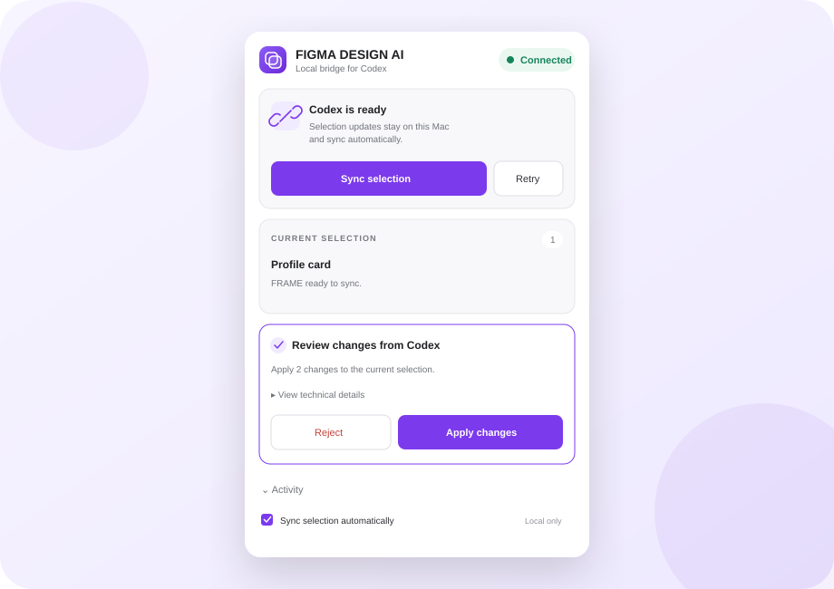
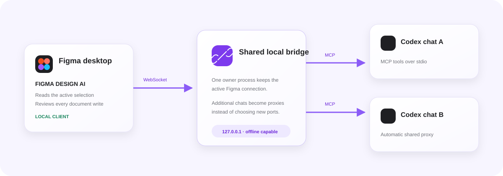

# FIGMA DESIGN AI

An independent, local-first bridge between the Figma desktop app and Codex. Read the active Figma selection, preview or export it, create editable designs, and apply targeted changes without sending document data to a third-party bridge service.



## What it does

- Discovers Codex automatically on the same Mac.
- Shares one bridge across multiple Codex chats.
- Syncs the active Figma selection as a structured node tree.
- Returns PNG previews and PNG/SVG exports.
- Creates frames, components, text, rectangles, ellipses, and lines.
- Applies safe property changes only within the active selection.
- Asks for approval in Figma before every document write.
- Keeps local transport and Figma scene operations available without internet.

## How it works



The Figma plugin connects to a loopback-only WebSocket. The Codex companion exposes MCP tools over stdio and keeps a single shared bridge on the Mac. New Codex chats reuse the active Figma connection instead of competing for new ports.

## Install

### Figma plugin

1. Open the Figma desktop app and a Figma Design file.
2. Choose **Plugins → Development → Import plugin from manifest…**.
3. Select [`manifest.json`](manifest.json) from this repository.
4. Run **Plugins → Development → FIGMA DESIGN AI**.

### Codex companion

The companion lives in [`codex-connector/`](codex-connector/). Install it through a local Codex plugin marketplace, then start a new Codex chat so its skill and MCP tools are loaded.

## Use

1. Open the target Figma file.
2. Run **FIGMA DESIGN AI** and wait for **Connected**.
3. Start a Codex chat and ask for an outcome:

```text
Use FIGMA DESIGN AI. Inspect the selected frame and show me a preview.
```

```text
Use FIGMA DESIGN AI. Create a profile card beside the current selection.
```

```text
Use FIGMA DESIGN AI. Change the selected button to green with a 12 px corner radius.
```

For reads, select one or more layers in Figma first. For creates, no selection is required. Every write appears in the plugin as a review step with **Reject** and **Apply changes** actions.

## Connection states

- **Connected** — Codex is ready and selection updates sync automatically.
- **Connecting** — the plugin is discovering the local companion.
- **Offline** — open a Codex chat with the companion enabled, then select **Retry**.
- **Other file** — another Figma file owns the connection; select **Retry** to switch to this file.
- **Update needed** — the Figma plugin and Codex companion use incompatible protocol versions.

No port number or pairing code is required.

## Project structure

```text
.
├── manifest.json          # Figma development plugin manifest
├── code.js                # Figma scene read/write runtime
├── ui.html                # Plugin panel and local connection client
├── DESIGN_IR.md           # Supported editable design schema
├── codex-connector/       # Codex plugin, skill, MCP server, and tests
└── docs/
    ├── SETUP.md
    ├── TROUBLESHOOTING.md
    └── images/
```

## Security and privacy

- The bridge binds only to `127.0.0.1`.
- The Figma manifest allows only the local WebSocket endpoint.
- The connector accepts only loopback clients with the FIGMA DESIGN AI client key.
- Every create or patch operation requires explicit approval inside Figma.
- Patch operations are restricted to selected nodes and their descendants.
- Codex model requests still follow the network and privacy settings of the Codex app.

## Development

Run the connector smoke test:

```bash
node codex-connector/scripts/smoke-test.mjs
```

The test starts two MCP processes, verifies that they share one local bridge, connects a mock Figma client, reads a selection, and completes an approved write round trip.

## Documentation

- [Detailed setup](docs/SETUP.md)
- [Troubleshooting](docs/TROUBLESHOOTING.md)
- [DesignIR reference](DESIGN_IR.md)

## Status

Personal development plugin. macOS and Figma desktop are the primary supported environment.
