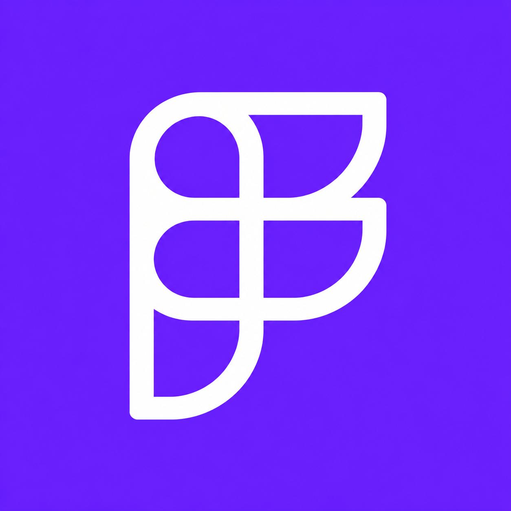
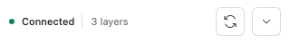

# FigLink

An independent, local-first bridge between the Figma desktop app and Codex. Read the active Figma selection, preview or export it, create editable designs, and apply targeted changes without sending document data to a third-party bridge service.





## Compact panel and remembered consent (0.5)

FigLink opens as a 320 × 48 px status bar (excluding Figma's native title bar). Expand it for selection details, Auto-sync, Auto-apply, Reconnect and Activity. On first use, choose **Ask each time** or **Allow & remember**. This preference is stored on this device for this plugin, across files and restarts. Auto-apply executes create/edit commands while the panel is open. Disable it in settings to restore individual approval. Reads do not require approval; editing remains scoped to the selection and its descendants. Writes retain Figma undo boundaries.

The refined letterform icon is included in `assets/figlink-monogram.png`; the earlier linked-frame concept is retained as `assets/figlink-icon.png`. Figma's manifest has no icon field; choose the icon when publishing through Figma. Imported development plugins may retain the generic code icon. No Figma Community publication is included in this release.

The repository URL and internal `figma-local-bridge` connector ID stay unchanged for compatibility. Import the root `manifest.json` again to refresh the display name to FigLink.

## What it does

- Discovers Codex automatically on the same Mac.
- Shares one bridge across multiple Codex chats.
- Syncs the active Figma selection as a structured node tree.
- Returns PNG previews and PNG/SVG exports.
- Creates frames, components, text, rectangles, ellipses, and lines.
- Applies safe property changes only within the active selection.
- Supports individual write approval or remembered Auto-apply consent.
- Keeps local transport and Figma scene operations available without internet.

## How it works


The Figma plugin connects to a loopback-only WebSocket. The Codex companion exposes MCP tools over stdio and keeps a single shared bridge on the Mac. New Codex chats reuse the active Figma connection instead of competing for new ports.

## Install

### Figma plugin

1. Open the Figma desktop app and a Figma Design file.
2. Choose **Plugins → Development → Import plugin from manifest…**.
3. Select [`manifest.json`](manifest.json) from this repository.
4. Run **Plugins → Development → FigLink**.

### Codex companion

The companion lives in [`codex-connector/`](codex-connector/). Install it through a local Codex plugin marketplace, then start a new Codex chat so its skill and MCP tools are loaded.

## Use

### Layer-first implementation (0.4)

For whole-frame analysis and implementation, the connector reads `figma_get_design_context` pages until `complete: true`. This has no tree-depth limit. Nodes include parent IDs, sibling order, geometry, transforms, Auto Layout and mixed-style text runs. Image fills/strokes and vector layers are listed as asset references. A changed document or selection invalidates the cursor; restart the read instead of combining inconsistent pages.

Use `figma_export_asset` with a descendant node ID and an absolute output directory to save PNG/SVG files without changing the selection. Pass an image hash from context to retrieve original image bytes. Render the layer as PNG when the visible crop is needed. Each export creates a unique file and returns a node-to-file mapping. Assets are capped at 8 MB per request; use a smaller rendered PNG for larger originals. Raw images may need to be downloaded by Figma if they are not cached.

Screenshots are visual references, never substitutes for the layer tree. Compact selection snapshots remain bounded and now explicitly report truncation.

After upgrading both parts, restart the Figma development plugin and Codex, then start a new task. Existing running bridges do not hot-reload server code.

1. Open the target Figma file.
2. Run **FigLink** and wait for **Connected**.
3. Start a Codex chat and ask for an outcome:

```text
Use FigLink. Inspect the selected frame and show me a preview.
```

```text
Use FigLink. Create a profile card beside the current selection.
```

```text
Use FigLink. Change the selected button to green with a 12 px corner radius.
```

For reads, select one or more layers in Figma first. For creates, no selection is required. With Auto-apply off, writes show **Reject** and **Apply changes**. With it on, they run immediately.

## Connection states

- **Connected** — Codex is ready and selection updates sync automatically.
- **Connecting** — the plugin is discovering the local companion.
- **Offline** — open a Codex chat with the companion enabled, then select **Retry**.
- **Other file** — another Figma file owns the connection; select **Retry** to switch to this file.
- **Update needed** — the Figma plugin and Codex companion use incompatible protocol versions.

No port number or pairing code is required.

## Project structure

```text
.
├── manifest.json          # Figma development plugin manifest
├── code.js                # Figma scene read/write runtime
├── ui.html                # Plugin panel and local connection client
├── DESIGN_IR.md           # Supported editable design schema
├── codex-connector/       # Codex plugin, skill, MCP server, and tests
└── docs/
    ├── SETUP.md
    ├── TROUBLESHOOTING.md
    └── images/
```

## Security and privacy

- The bridge binds only to `127.0.0.1`.
- The Figma manifest allows only the local WebSocket endpoint.
- The connector accepts only loopback clients with the FigLink client key.
- Writes require individual approval or the user's saved Auto-apply consent.
- Patch operations are restricted to selected nodes and their descendants.
- Codex model requests still follow the network and privacy settings of the Codex app.

## Development

Run the connector smoke test:

```bash
node codex-connector/scripts/smoke-test.mjs
```

The test starts two MCP processes, verifies that they share one local bridge, connects a mock Figma client, reads a selection, and completes an approved write round trip.

## Documentation

- [Detailed setup](docs/SETUP.md)
- [Troubleshooting](docs/TROUBLESHOOTING.md)
- [DesignIR reference](DESIGN_IR.md)

## Status

0.4.1 fixes startup in Figma dynamic-page mode: context invalidation now uses the active page's `nodechange` event and `stylechange`, reattaching when the active page changes. No full-document load is required. The bridge protocol/server remains compatible with 0.4.0.

Personal development plugin. macOS and Figma desktop are the primary supported environment.
